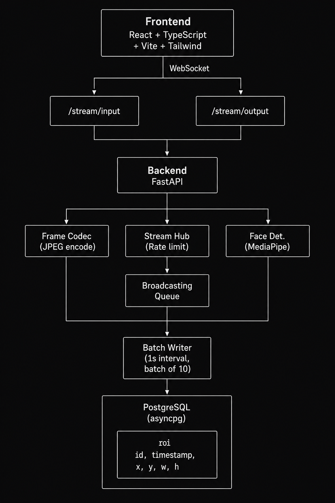

# Face Sense

Real-time face detection and tracking application with WebSocket streaming.

## Architecture



| Layer | Technology |
|-------|------------|
| Frontend | React + TypeScript + Vite + Tailwind CSS |
| Backend | FastAPI (Python) with async SQLAlchemy |
| Database | PostgreSQL (asyncpg) |
| Face Detection | MediaPipe (TensorFlow Lite) |

## Features

- Real-time face detection using MediaPipe
- WebSocket-based streaming (input → processing → output pipelines)
- Batch ROI storage for high-throughput scenarios
- Rate limiting per client (configurable FPS)
- Frame validation (dimensions, format)
- Camera switching for multi-camera devices
- Auto-reconnection on WebSocket disconnect
- Loading states and error handling UI
- Camera selector dropdown
- React ErrorBoundary for graceful error recovery

## Quick Start

### Using Docker Compose

```bash
docker compose up --build
```

Access the application at http://localhost:5173

### Manual Setup

#### Backend

```bash
cd backend
python -m venv .venv
source .venv/bin/activate
pip install -r requirements.txt
uvicorn app.main:app --host 0.0.0.0 --port 8000
```

#### Frontend

```bash
cd frontend
npm install
npm run dev
```

## API Endpoints

| Method | Path | Description |
|--------|------|-------------|
| GET | /health | Health check (returns status, database, processor, uptime) |
| GET | /roi | List detection ROIs (supports `?limit=1-200`) |
| WebSocket | /stream/input | Stream video frames to server |
| WebSocket | /stream/output | Receive processed frames |

### Health Response

```json
{
  "status": "ok",
  "database": "healthy",
  "processor": "enabled",
  "uptime_seconds": 3600.5
}
```

### WebSocket Protocol

**Input** (`/stream/input`):
- Send JPEG images as binary data

**Output** (`/stream/output`):
```json
{
  "image_base64": "<base64_encoded_jpeg>",
  "roi": {
    "id": 1,
    "timestamp": "2024-01-15T10:30:00Z",
    "x": 120,
    "y": 80,
    "width": 200,
    "height": 200
  },
  "note": "face_detected"
}
```

### Status Notes

| Note | Description |
|------|-------------|
| (no key) | Frame processing successful |
| no_face | No face detected in frame |
| invalid_frame | Unable to decode frame as image |
| frame_dimensions_exceeded | Frame exceeds MAX_WIDTH or MAX_HEIGHT |
| processing_error | Server-side processing error |

### Input Error Responses

| Error | Description |
|-------|-------------|
| frame_too_large | Frame exceeds MAX_FRAME_BYTES |
| rate_limited | Client FPS exceeds MAX_FPS_PER_CLIENT |

### ROI Query Parameters

| Param | Valid Range | Default |
|-------|-------------|---------|
| limit | 1-200 | 20 |

## Environment Variables

### Backend

| Variable | Default | Description |
|----------|---------|-------------|
| DATABASE_URL | postgresql+asyncpg://postgres:postgres@db:5432/facestream | Database connection string |
| MAX_FRAME_BYTES | 2097152 | Max frame size (bytes) |
| MAX_WIDTH | 1920 | Max video width |
| MAX_HEIGHT | 1080 | Max video height |
| MAX_FPS_PER_CLIENT | 12.0 | Rate limit (FPS per client) |
| ENABLE_PROCESSOR | true | Enable face detection processor |

### Frontend

| Variable | Default | Description |
|----------|---------|-------------|
| VITE_API_WS | ws://localhost:8000 | WebSocket endpoint |

## Technical Details

### Frame Processing Pipeline

1. Client captures camera frame via `getUserMedia()`
2. Frame drawn to canvas and converted to JPEG
3. JPEG binary sent via WebSocket to `/stream/input`
4. Server validates frame (size, format, dimensions)
5. MediaPipe detects face bounding box
6. Bounding box drawn on image (green rectangle)
7. Processed frame sent to all clients via `/stream/output`
8. ROI data batch-written to PostgreSQL (every 1s, batch of 10)

### Rate Limiting

- Each client has a sliding window rate limiter
- Default: 12 FPS per client
- Excess frames are dropped server-side

### Batch Processing

- ROIs queued in memory during processing
- Background task flushes queue every 1 second
- Batch size: up to 10 ROIs per database write
- Final batch written on shutdown

## Usage

1. Allow camera access when prompted
2. The raw camera feed displays in the LIVE panel
3. Processed frames (with face bounding box) overlay the camera feed
4. Detection status shows below the video panel
5. Use "Switch Camera" to toggle between available cameras

## License

MIT